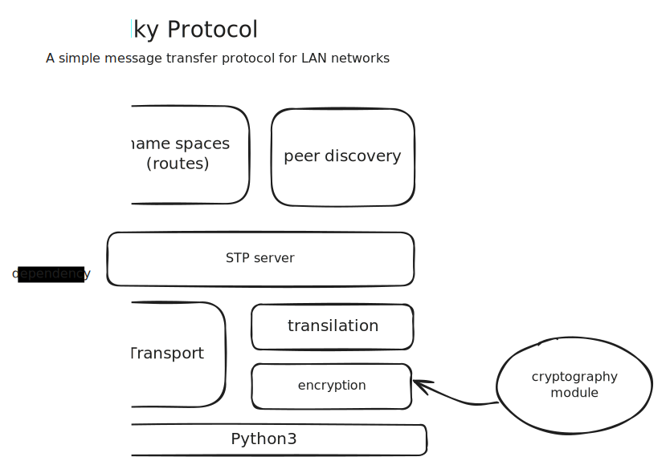

# STP : Sitty Talky Protocol
⚠️ **Work In Progress**

⚠️ Beware of the buzzword: Spanig Tree Protocol. The STP described over here is much more stupid..

**STP: Sitty Talky messaging Protocol** : A primitive protocol purely written in python for tinkering with your office mates over LAN! Originally created for my side project [Sitty Talky](https://github.com/bruttaZz/sittytalky).


### STP uses and have

- uses UDP for peer finding and broadcasting (actually it's multicasting (used to reduce trafic (as part of being a good citizon)))
- uses TCP for peer to peer connection (usual things)
- A unique peer discovery mechanism (may not be perfect though)
- An end-to-end encrypted peer to peer messaging facility by default (I mean real end-to-end)
- Good news: there is no threads being spawned, the system can be added to your existing python eventloop (if needed)


### Requirements
- **Python version >= 3.11** (As it currently uses `loop.sock_recvfrom` in `asyncio`, Otherwise should go with the `loop.run_in_executor`, which I am not interested on)

- Internally uses **[Pycryptodome](https://pypi.org/project/pycryptodome/)** for rsa encryption.
- **The system is tested only on Unix (GNU/Linux to be specific)**

### Installation
This package can be installed from PyPi using
```sh
pip install stp-server
```

Or directly from github using 
```sh
pip install 'stp-server @ git+https://github.com/bRuttaZz/stp.git'
```


### Usage
**A simple use case is demonstated bellow**

starting the server
```py
from stp import STPServer
from stp.interfaces import Packet, Peer

app = STPServer()

@app.route("/test-route")
def test_route_func(packet:Packet):
    print(f"Message got from {packet.headers.user}@{packet.sender} : {packet.data}")

# bind events
@app.on_peer_list_update
def peer_list_change(new_peer:Peer, removed_peers:list[Peer]):
    print(f"Peer list changed : new peer -> {new_peer.user}@{new_peer.ip}" +
                f" : removed peers -> {len(removed_peers)}")
    
if __name__=="__main__":
    print(f"starting server ...")
    app.run()
```

sending messages to the client over a LAN network
```py
from stp import STPServer

app = STPServer()
    
if __name__=="__main__":
    app.broadcast("/test-route", "hi dear")
    # app.send_to_peer() # work only if peers are discovered (uses TCP)
```

### The module architecture




