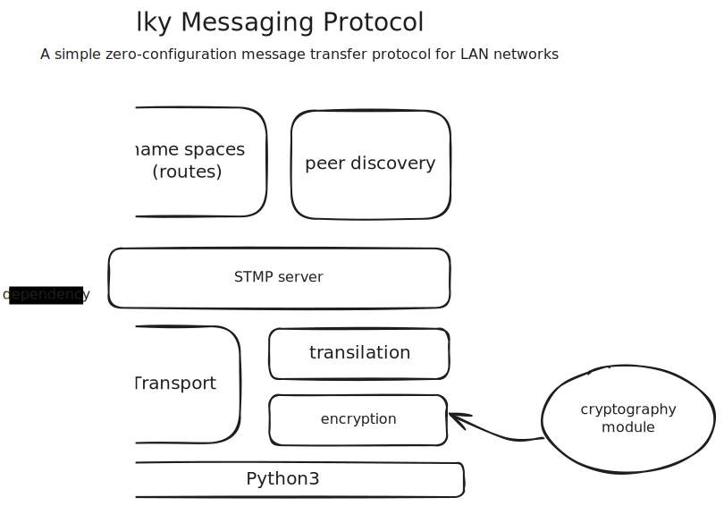

# STMP : Sitty Talky Messaging Protocol

⚠️ **Work In Progress**

**STMP: Sitty Talky Messaging Protocol** : A primitive zero-configuration local network protocol purely written in python, originally intended for tinkering with my office mates over LAN! Created as part of my side project [Sitty Talky](https://github.com/bruttaZz/sittytalky) (hence the name).

[](https://pypi.org/project/stmp-server/)
[](https://github.com/bruttazz/stmp/releases/latest)
[](https://github.com/bRuttaZz/stmp/actions/workflows/pylint.yml)
[](https://github.com/bRuttaZz/stmp/actions/workflows/releasebuild.yml)


---

### Features

- Yet another zero-configuraion protocol
- A unique peer discovery mechanism (not thaat special though!)
- Message broadcasting facility over UDP
- An end-to-end encrypted peer to peer messaging facility over TCP (I mean real end-to-end encryption)
- Support middlewares and message routing
- Support automated peer discovery
- Single threaded, the system can be clubbed with other asyncio eventloops
- STMP uses multicasting for message broadcasting and peer discovery, reducing network traffic.. (me being a responsible citizen)


### Requirements
- **Python>=3.11** (As it currently uses `loop.sock_recvfrom` in `asyncio` the minimum python version requirement is 3.11, Otherwise should go with the `loop.run_in_executor` based implementation, which I'm not interested in (anyway it will reduce the requirement to *py3.7*))

- Internally uses **[Pycryptodome](https://pypi.org/project/pycryptodome/)** for rsa cryptography.
- **Unix** (probably) as the system is tested only on Unix (GNU/Linux to be specific)


### Installation
STMP package can be installed from PyPi using
```sh
pip install stmp-server
```

Or directly from github using 
```sh
pip install 'stmp-server @ git+https://github.com/bRuttaZz/stmp.git'
```


### Usage
An example use case is demonstrated bellow. ([see example](https://github.com/bRuttaZz/stmp/tree/main/examples/listener-sender))

Start a listener process
```py
from stmp import STMPServer
from stmp.interfaces import Packet, Peer

app = STMPServer()

@app.route("/test-route")
def test_route_func(packet:Packet):
    print(f"Message got from {packet.headers.user}@{packet.sender} : {packet.data}")

# bind events
@app.on_peer_list_update
def peer_list_change(new_peer:Peer, removed_peers:list[Peer]):
    print(f"Peer list changed : new peer -> {new_peer.user}@{new_peer.ip}" +
                f" : removed peers -> {len(removed_peers)}")
    
if __name__=="__main__":
    print(f"starting server ...")
    app.run()
```

Send messages to it using another client over a LAN network
```py
from stmp import STMPServer

app = STMPServer()
    
if __name__=="__main__":
    app.broadcast("/test-route", "hi dear")
    # app.send_to_peer() # work only if peers are discovered (uses TCP)
```

### The module architecture




